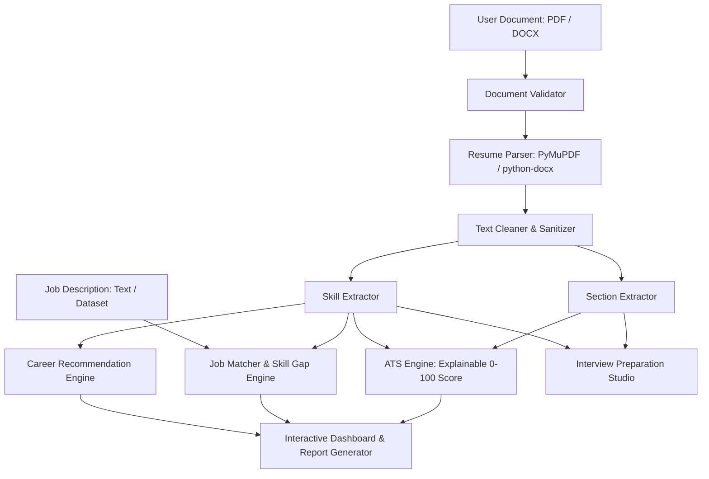

# CareerAI — AI Resume Analyzer & Job Matcher

> **Analyze Your Resume. Match Your Skills. Build Your Career.**

A modern, SaaS-style career intelligence platform engineered for students, fresh graduates, and experienced job seekers. CareerAI delivers end-to-end resume intelligence: from deterministic text extraction and explainable ATS compatibility scoring to multi-criteria job description matching, skill gap prioritization, career role recommendations, and structured interview preparation.

---

## Table of Contents

- [Overview](#overview)
- [Key Features](#key-features)
- [Technology Stack](#technology-stack)
- [System Architecture](#system-architecture)
- [Project Structure](#project-structure)
- [Installation & Setup](#installation--setup)
- [Environment Variables](#environment-variables)
- [Dataset Setup & Attribution](#dataset-setup--attribution)
- [Running Locally](#running-locally)
- [Running Tests](#running-tests)
- [Deployment Guidelines](#deployment-guidelines)
- [Privacy & Ethical AI Commitments](#privacy--ethical-ai-commitments)
- [Limitations & Roadmap](#limitations--roadmap)
- [License](#license)

---

## Overview

Modern hiring workflows rely heavily on Applicant Tracking Systems (ATS) and automated screening. Candidates frequently struggle with opaque rejection criteria, unoptimized resume formatting, and ambiguous skill mismatches.

**CareerAI** bridges this gap by providing an open, explainable career platform that:
1. **Parses** PDF and DOCX resumes without data corruption.
2. **Evaluates** ATS compatibility using an objective, transparent 0–100 weighted rubric (never a pseudo-random or fabricated score).
3. **Extracts & Normalizes** domain skills across Programming, Web, Data, AI/ML, Cloud/DevOps, Databases, and Bioinformatics.
4. **Matches** resumes against target job postings with multi-vector similarity and prioritized skill gaps (High / Medium / Low).
5. **Recommends** aligned tech pathways and provides targeted interview preparation.

---

## Key Features

- **Multi-Format Document Parsing:** Native extraction for `.pdf` (via PyMuPDF) and `.docx` (via python-docx) with handling for scanned/empty documents.
- **Explainable ATS Scoring Engine (0–100):** Transparent scoring rubric across Contact Info (5%), Summary (10%), Education (10%), Experience (20%), Skills (20%), Projects (15%), Certifications (5%), Keywords (10%), and Formatting/Readability (5%).
- **Skill Extraction & Normalization:** Domain-mapped taxonomy with alias canonicalization (e.g., `JS` → `JavaScript`, `ML` → `Machine Learning`, `TF` → `TensorFlow`).
- **Job Description Matcher & Gap Analysis:** Side-by-side comparison yielding categorized skills you have, required skills, missing skills, and prioritized learning recommendations.
- **Career Pathway Engine:** Evaluates fit against 12+ industry roles including Python Developer, Data Analyst, Machine Learning Engineer, AI Engineer, Bioinformatics Analyst, and DevOps Engineer.
- **Truth-Preserving AI Enhancements:** When enabled, LLM enhancements improve grammar, action verbs, and bullet impact strictly without hallucinating or fabricating degrees, job titles, or companies.
- **Dual Operating Modes:** Operates 100% offline in Local/Rule-Based mode with zero API keys required, and seamlessly switches to AI-Enhanced mode when an API key is provided.

---

## Technology Stack

| Layer | Technologies |
|---|---|
| **Frontend / UI** | Streamlit (Python 3.11+) |
| **Document Ingestion** | PyMuPDF (`fitz`), `python-docx` |
| **Data & Computation** | Pandas, NumPy, Scikit-Learn |
| **Visualizations** | Plotly |
| **Local Persistence** | SQLite |
| **AI Integration** | Modular LLM abstraction layer (`ai_engine.py`) supporting Google Gemini / OpenAI |
| **Testing** | Pytest, Unittest |

---

## System Architecture



---

## Project Structure

```
CareerAI/
├── app.py                            # Streamlit Landing Page & Navigation Hub
├── pages/
│   ├── 01_Resume_Analyzer.py         # ATS Scoring, Section & Skill Breakdown
│   ├── 02_Job_Matcher.py             # Target Job Description Matcher & Skill Gaps
│   ├── 03_Career_Recommendation.py   # Role Suitability & Career Pathways
│   ├── 04_Interview_Preparation.py   # Curated & Tailored Interview Questions
│   └── 05_About.py                   # Architecture, Methodology & Privacy Policy
├── modules/
│   ├── resume_parser.py              # PDF and DOCX text extractor
│   ├── document_validator.py         # Mime-type, size, and content validator
│   ├── text_cleaner.py               # Bullet point & character normalization
│   ├── section_extractor.py          # Resume section detection & segmentation
│   ├── skill_extractor.py            # Taxonomy-based skill extraction & aliases
│   ├── ats_engine.py                 # 0-100 Explainable ATS scoring logic
│   ├── job_matcher.py                # Multi-factor matching & gap analysis
│   ├── career_engine.py              # Career role recommendation engine
│   ├── ai_engine.py                  # Decoupled AI/LLM abstraction layer
│   ├── interview_engine.py           # Technical & behavioral interview questions
│   └── report_generator.py           # Diagnostic PDF summary generator
├── database/
│   └── database.py                   # SQLite tables and connection managers
├── data/
│   ├── resumes/                      # Local resume dataset storage (gitignored)
│   └── job_descriptions/             # Local job dataset storage (gitignored)
├── assets/
│   └── images/                       # UI graphics and static branding
├── utils/
│   ├── helpers.py                    # CSS styling, environment and formatting helpers
│   ├── validators.py                 # File and text heuristic validators
│   └── constants.py                  # Weights, roles, and skill taxonomies
├── tests/
│   ├── test_parser.py                # Validation and parser unit tests
│   ├── test_ats.py                   # ATS scoring unit tests
│   └── test_matching.py              # Matching and weighting unit tests
├── .env.example                      # Configuration environment template
├── .gitignore                        # Comprehensive Git ignore rules
├── requirements.txt                  # Python dependencies
└── README.md                         # Project documentation
```

---

## Installation & Setup

### 1. Clone the Repository
```bash
git clone https://github.com/your-username/CareerAI.git
cd CareerAI
```

### 2. Create and Activate a Virtual Environment
```bash
# Windows
python -m venv venv
.\venv\Scripts\activate

# macOS / Linux
python3 -m venv venv
source venv/bin/activate
```

### 3. Install Required Dependencies
```bash
pip install -r requirements.txt
```

---

## Environment Variables

Copy `.env.example` to `.env`:
```bash
cp .env.example .env
```

Configure your environment settings in `.env`:
```env
# AI Provider (Optional: if empty, CareerAI runs in rule-based local mode)
AI_API_KEY=your_gemini_or_openai_api_key_here
AI_MODEL=gemini-1.5-flash
AI_PROVIDER=gemini

# Application Settings
MAX_UPLOAD_SIZE_MB=5
DB_PATH=database/careerai.db
PERSIST_UPLOADS=false
```

---

## Dataset Setup & Attribution

Large benchmark datasets are **not** bundled inside the Git repository to respect GitHub size best practices and data governance guidelines.

### 1. Kaggle Resume Dataset
- **URL:** [Kaggle Resume Dataset](https://www.kaggle.com/datasets/snehaanbhawal/resume-dataset)
- **Purpose:** Resume classification benchmarking, skill extraction validation, and role profiling.
- **Setup:** Download `Resume.csv` from Kaggle and place it inside `data/resumes/`.

### 2. Kaggle Job Description Dataset
- **URL:** [Kaggle Job Description Dataset](https://www.kaggle.com/datasets/ravindrasinghrana/job-description-dataset)
- **Purpose:** Job posting matching, similarity benchmarking, and realistic skill gap testing.
- **Setup:** Download the job postings CSV and place it inside `data/job_descriptions/`.

*Note: The core application functions fully without these datasets; they are utilized for evaluation scripts and bulk testing.*

---

## Running Locally

To start the CareerAI web application, run:

```bash
streamlit run app.py
```

The application will launch at:
```
Local URL: http://localhost:8501
```

---

## Running Tests

Execute the automated test suite with `pytest`:

```bash
pytest tests/ -v
```

---

## Deployment Guidelines

### Streamlit Community Cloud
1. Push your repository to GitHub (ensure `.env` and `careerai.db` are excluded via `.gitignore`).
2. Log into [Streamlit Community Cloud](https://share.streamlit.io/).
3. Connect your repository, select `app.py` as the main entry point, and deploy.
4. Add your `AI_API_KEY` under **App settings → Secrets**.

### Docker Deployment
Create a `Dockerfile` for containerized hosting:
```dockerfile
FROM python:3.11-slim
WORKDIR /app
COPY requirements.txt .
RUN pip install --no-cache-dir -r requirements.txt
COPY . .
EXPOSE 8501
CMD ["streamlit", "run", "app.py", "--server.port=8501", "--server.address=0.0.0.0"]
```

---

## Privacy & Ethical AI Commitments

- **Ephemeral Processing by Default:** Resumes uploaded for analysis are held in volatile memory during the user session and are not permanently saved without explicit user instruction.
- **Zero PII Logging:** Personal identifying information (phone numbers, personal addresses, emails) is scrubbed and never written to diagnostic server logs.
- **Explainable Metrics (No Fake AI):** Scores are computed from transparent, verifiable heuristics and cosine similarity metrics. CareerAI never fabricates random scores or claims algorithmic affiliations with commercial ATS vendors.
- **Strict Truth-Preservation:** Generative resume improvements refine tone and structure while strictly preserving the authentic facts of the candidate's history.

---

## Limitations & Roadmap

### Current Limitations
- Scanned (pure image) PDFs without OCR text layers cannot be extracted by fitz directly (image OCR planned).
- Multi-column resume layouts with non-standard visual reading orders can occasionally interleave text sections.

### Planned Enhancements
- Tesseract OCR fallback for scanned resumes.
- Exportable LaTeX and Docx resume templates.
- Automated LinkedIn profile alignment.
- Live job board integration via public APIs.

---

## License

This project is released under the [MIT License](LICENSE). Please review dataset source licenses individually on Kaggle before distributing derived commercial models.
